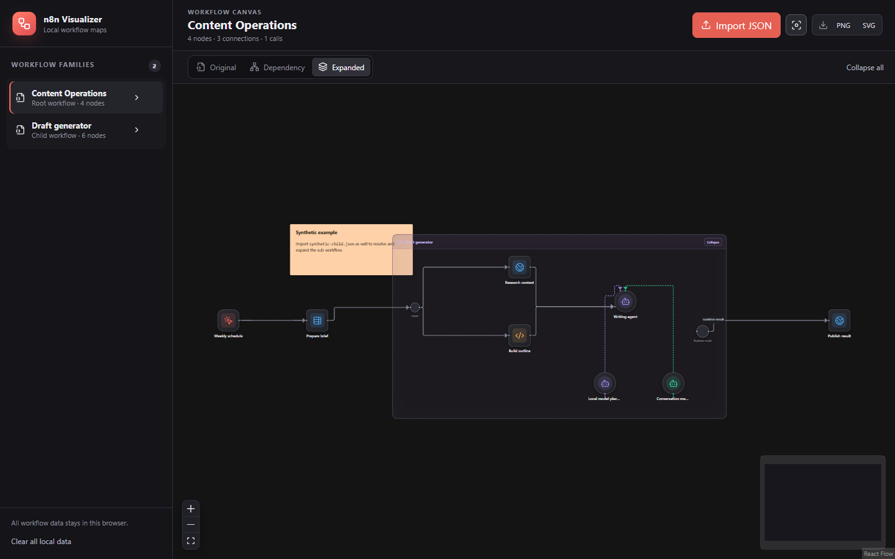

# n8n Workflow Visualizer

A privacy-first, browser-only visualizer for n8n workflow JSON exports. Import several workflows, inspect and rearrange their exported layout, map parent/child dependencies, expand static sub-workflow calls inline, or animate a graph-only execution simulation.



## What it does

- Parses single workflows, arrays, and common `{data: ...}` wrappers without depending on n8n frontend code.
- Preserves arbitrary connection types, sparse/multiple outputs, target input indexes, unknown future node types, sticky notes, and disabled nodes.
- Resolves imported sub-workflows by exported workflow ID, including legacy strings and current resource-locator values.
- Represents dynamic, missing, embedded, deprecated local-file/URL, invalid, disabled, and recursive references explicitly.
- Offers two focused views:
  - **View** — exported n8n positions with expandable nested boundaries, type-specific tiles/icons, dynamic multi-input nodes, all socket types, drag/multi-select, and conservative result routing.
  - **Dependency** — deterministic Dagre layout for the selected workflow family, including clickable missing-dependency warnings.
- Connects external edges only to expanded workflow boundaries. Possible internal starts can be highlighted on demand; internal end nodes remain visually unchanged, with no cross-boundary lines or port circles.
- Supports free node movement, multi-selection, camera reset, and restoring every node to its exported/generated location.
- Simulates graph traversal without executing node logic. Parallel fan-out runs in the same fixed-duration step, joins wait for all live branches, and the completed route remains highlighted with repeat counts. Expanded workflows wait for every active internal branch before releasing one continuation to the caller.
- Includes four simulation modes: **Random** chooses branches, **Custom** routes toward one or more checkpoints, **All** favors the route with the greatest reachable node coverage, and **Shortest** finds the fewest-node route to one selected destination. Conflicting Custom checkpoints can be highlighted as separately numbered branch groups.
- Offers Repeat and Follow controls. Follow smoothly pans—without changing zoom—only when active nodes leave the central 50% of the visible canvas.
- Highlights missing calls with a pulse, possible start nodes on demand, and gives each distinct loop a numbered color indicator. Missing-dependency messages report both unique workflow IDs and total call references.
- Provides an optional right-hand statistics panel with node and connection totals for both the selected workflow and all resolved descendants, plus sub-workflow, loop, branch, and main-workflow end-node counts.
- Saves raw imports and UI state in IndexedDB, then reparses raw data with the current parser when restored.
- Exports the graph stage as PNG (up to 2× within safe canvas limits) or SVG.
- Routes orthogonal connections around node bodies while retaining every exported output and input index.

All processing is local. The application has no analytics, service worker, external fonts/CDNs, or application network calls. It never opens imported file paths or fetches imported URLs. Production builds include a CSP with `connect-src 'none'`.

## Try the synthetic sample

Run the app, then import both files in [`examples`](examples):

```bash
npm install
npm run dev
```

The sample is synthetic and contains no user workflow data. Real exports supplied during development were used only for local smoke testing and are not present in this repository.

## Using the viewer

1. Select **Import JSON** (or drag JSON exports onto the window). Import a parent workflow and any static database-ID sub-workflows you want resolved.
2. Use **View** to inspect or expand workflow calls. Click an expanded boundary to collapse it, or a collapsed Execute Workflow node to expand it. Drag nodes freely, Ctrl-click to select several, and use the lower-left reset controls to restore the camera or exported node positions.
3. Use **Dependency** to see the workflow family and unresolved calls. Missing warnings are clickable, and the Highlight missing toggle makes unresolved calls pulse.
4. Choose a simulation mode and speed. In Custom mode, click nodes to add checkpoints. In Shortest mode, click one destination. Simulation is structural only: it follows connections and never runs n8n node logic.
5. Open **Statistics** for a summary of the selected workflow, or export the full graph bounds as PNG/SVG.

Imported workflows and UI state are stored only in that browser profile. **Clear all local data** removes the application’s IndexedDB stores.

## Development

Node.js 24 LTS is recommended for development and CI (minimum 22.12).

```bash
npm ci
npm run typecheck
npm run test:run
npm run build
npx playwright install chromium
npm run e2e
```

The parser's public entry point is [`src/n8n/index.ts`](src/n8n/index.ts). Compatibility findings and the pinned n8n source snapshot are in [`docs/n8n-compatibility.md`](docs/n8n-compatibility.md); subsystem boundaries and security choices are in [`docs/architecture.md`](docs/architecture.md).

## Import and resolution rules

Duplicate exported IDs replace the stored workflow; the last match in an import batch wins. Valid files in a batch remain imported when another file fails. ID-less exports receive a deterministic local identity but cannot satisfy database-ID references.

Only static imported database IDs and literal embedded workflows expand. Expressions are never evaluated or name-matched. File and URL source modes stay inert external placeholders.

An expanded workflow hides exactly one enabled Execute Sub-workflow Trigger and records all of its outgoing targets as possible starts. The Start nodes control reveals them when requested. If the trigger is missing, disabled, or ambiguous, the boundary shows a warning and graph roots are recorded conservatively. Outside connections terminate at the workflow boundary; invisible logical links preserve simulation continuity without drawing cross-boundary lines.

## GitHub Pages

The repository includes a Pages workflow, but deployment is gated and disabled by default. To opt in later:

1. Explicitly enable Pages in the repository settings.
2. Add a repository variable named `ENABLE_PAGES_DEPLOYMENT` with value `true`.
3. Run the **Deploy GitHub Pages** workflow or push to `main`.

The Vite base path is derived from `GITHUB_REPOSITORY`, so a repository rename is handled on the next build. Be aware that a Pages site can be public even when its source repository is private, and private-repository Pages availability depends on the GitHub plan.

## Security and scope

The repository contains only synthetic examples and screenshots. No credentials, API keys, environment files, user workflow exports, analytics, telemetry, or runtime network integrations are required. Imported Markdown is sanitized, raw HTML is disabled, remote media is blocked, and workflow URL/file references are displayed but never opened automatically.

V1 does not support `.n8np` archives, changing workflow definitions, node inspectors, manual mapping for dynamic references, external workflow lookup, or real workflow execution. Dragged positions are viewer-only and are not written back to imported JSON.

## License

[MIT](LICENSE)
